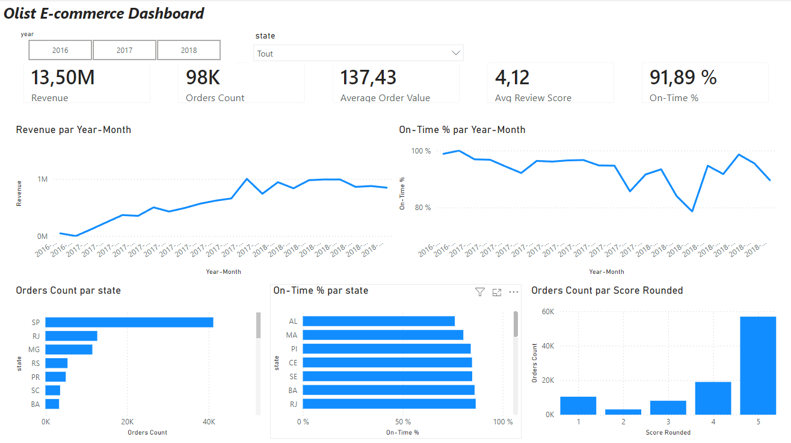

# Olist E-commerce Data Warehouse & Dashboard

End-to-end BI project on the Olist Brazilian e-commerce dataset.
Python ETL loads the data into a PostgreSQL star schema, and Power BI shows 5 KPIs.



## Pipeline

```
9 CSV files -> ETL (Python, pandas) -> PostgreSQL (olist_dw) -> Power BI
```

## Data model (star schema)

- `fact_orders`: 1 row = 1 order (revenue, review score, is_on_time)
- `dim_customers`: who (city, state)
- `dim_date`: when (date, year)

Orders removed: canceled orders and orders with no items. Result: 98,205 orders.

## KPIs

| KPI | Definition |
|---|---|
| Revenue | Sum of item prices |
| Orders | Number of orders |
| Average order value | Revenue / orders |
| Average review score | Average of review scores |
| On-time delivery | Orders delivered on or before the estimated date / delivered orders |

## Tech stack

Python (pandas, SQLAlchemy, python-dotenv), PostgreSQL, Power BI Desktop

## How to run

1. Download the Olist dataset from Kaggle and put the CSV files in `data/raw/`.
2. Create the database `olist_dw` and run `sql/tables.sql` in pgAdmin.
3. Install the libraries:
```
   pip install pandas sqlalchemy psycopg2-binary python-dotenv
```
4. Create a `.env` file in the project root:
```
   DB_USER=postgres
   DB_PASSWORD=<your_password>
   DB_HOST=localhost
   DB_PORT=5432
   DB_NAME=olist_dw
```
5. Run the ETL:
```
   python etl/load.py
```
6. Open `olist_dashboard.pbix` in Power BI Desktop and refresh.

## Author

Aicha, ISIMM, https://www.linkedin.com/in/aicha-benhmida